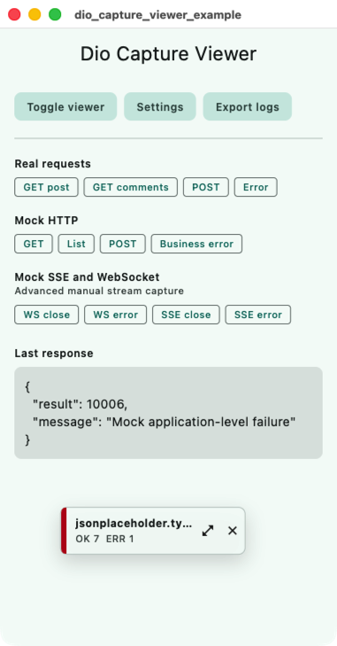
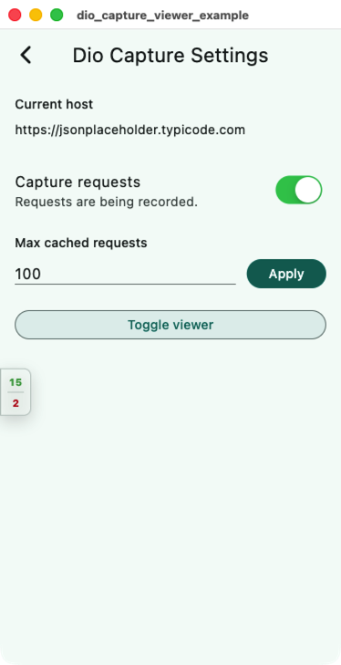
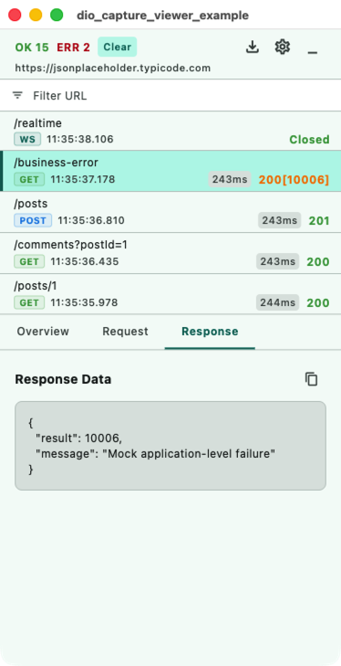
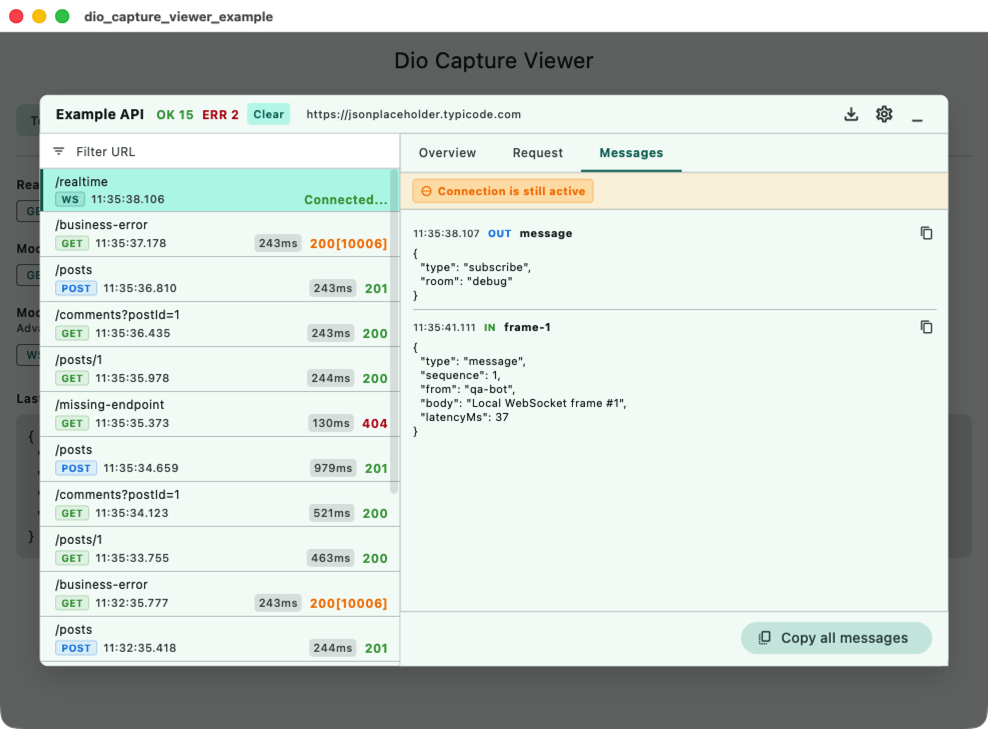

# dio_capture_viewer

[](https://pub.dev/packages/dio_capture_viewer)

[中文文档](README_zh.md)

A lightweight in-app network capture viewer for Flutter apps that use Dio.

It adds one Dio interceptor and a floating Material UI panel where you can
inspect request headers, query parameters, request bodies, response payloads,
errors, status codes, request durations, SSE events, and WebSocket messages.

## Features

- Floating draggable viewer with compact, docked, and full-screen modes.
- Dio interceptor for request, response, error, duration, and payload capture.
- Protocol support for HTTP/Dio, manually reported SSE, and manually reported
  WebSocket sessions.
- Header redaction for authorization, cookies, and token-like fields.
- Filterable request list, payload copy actions, and protocol-aware
  `Copy To Curl` command generation.
- Optional one-click JSON Lines (`.jsonl` / NDJSON) export callback for app-owned
  loading and file saving flows.
- Optional toast callback for viewer actions such as copy, clear, and hide.
- File-like payloads such as images, videos, audio, PDFs, archives, and binary
  attachments are summarized as placeholders with format and size instead of
  rendering raw content.
- Settings entry callback and optional persistence bridge.

## Preview

<p>
  
  
  
</p>

<p>
  
</p>

## Usage

Create one `DioCaptureViewerController`, attach its interceptor to Dio, then
place the overlay above your app content.

```dart
import 'package:dio/dio.dart';
import 'package:dio_capture_viewer/dio_capture_viewer.dart';
import 'package:flutter/material.dart';

const apiHost = 'https://api.example.com';

final navigatorKey = GlobalKey<NavigatorState>();

final captureController = DioCaptureViewerController.init(
  enabled: true,
  showPanel: true,
  navigatorKey: navigatorKey,
  host: apiHost,
  // Optional. Rules only inspect top-level fields in JSON response objects.
  // A matching failure is shown as HTTP_STATUS[BUSINESS_CODE].
  businessCodeRules: const [
    CaptureBusinessCodeRule(
      field: 'result',
      successCodes: <Object>{10000},
    ),
    CaptureBusinessCodeRule(
      field: 'code',
      successCodes: <Object>{200},
    ),
  ],
  onSettingsTap: (context, store) {
    Navigator.of(context).push(
      MaterialPageRoute<void>(
        builder: (_) => YourCaptureSettingsPage(store: store),
      ),
    );
  },
  onCloseTap: (context, store) async {
    return await confirmHideCaptureViewer(context);
  },
  // Optional. Leave this unset if you do not want the Export button.
  exportHandler: CaptureExportHandler(
    exportStart: (context, store) {
      showYourLoading();
    },
    exportEnd: (context, store, file) async {
      hideYourLoading();
      await saveYourFile(
        fileName: file.fileName,
        mimeType: file.mimeType,
        bytes: file.bytes,
      );
    },
  ),
  // Optional. Leave this unset if you do not want action toasts.
  toast: (context, message) {
    showYourToast(message);
  },
);

final dio = Dio(BaseOptions(baseUrl: apiHost))
  ..interceptors.add(captureController.createInterceptor());

class App extends StatelessWidget {
  const App({super.key});

  @override
  Widget build(BuildContext context) {
    return MaterialApp(
      // Use the same key passed to DioCaptureViewerController.
      navigatorKey: navigatorKey,
      builder: (context, child) {
        return DioCaptureViewerOverlay(
          controller: captureController,
          child: child ?? const SizedBox.shrink(),
        );
      },
      home: const HomePage(),
    );
  }
}
```

The `navigatorKey` is optional if you do not open routes from viewer buttons.
When you use `onSettingsTap` or show dialogs from `onCloseTap`, pass the same
key to both `DioCaptureViewerController` and `MaterialApp`.

`toast` is optional. When it is not provided, the viewer does not show any
built-in toast or snackbar. When provided, copy, curl copy, clear, search-clear,
and hide actions call it with a short message.

`exportHandler` is optional. When it is not provided, the full-screen viewer
does not show the Export button. When provided, the viewer calls `exportStart`,
builds a JSON Lines log file from the current cache, then calls `exportEnd` with
a `CaptureExportFile`. The package prepares the data; your app owns the loading
UI and local file saving behavior.

`businessCodeRules` is optional and defaults to a single `code == 200` rule to
preserve the built-in behavior. Rules only inspect top-level fields in JSON
response objects. Numeric strings and numbers compare by value. All matching
rules are evaluated; a failure takes precedence over a success. Pass an empty
list to disable business-code checks.

`CaptureStore` exposes the settings you can place in your own capture settings
page:

```dart
captureController.store.setEnabled(true);
captureController.store.setMaxCacheSize(200);

final enabled = captureController.store.isEnabled;
final maxCacheSize = captureController.store.maxCacheSize;
```

If your app has its own persistence layer, implement `CapturePreferences` and
pass it into `CaptureStore(preferences: yourPreferences)`, then call
`captureStore.restore()` during startup.

The package does not export a settings page. It only provides the setting entry
callback, the floating viewer modes, the capture store, and the Dio interceptor.

## Advanced Configuration

### SSE and WebSocket capture

SSE and WebSocket capture is manual and dependency-free. Create a stream
session, then report inbound, outbound, close, and error events from whichever
client your app already uses.

Stream message UI refreshes are throttled to 2 seconds by default. Pass
`streamNotifyInterval: Duration.zero` to `DioCaptureViewerController.init` or
`CaptureStore` to refresh immediately on every message.

```dart
final socketCapture = captureController.store.startStreamCapture(
  protocol: CaptureProtocol.webSocket,
  url: 'wss://example.com/socket',
);

// Example shape for a WebSocketChannel-like client.
channel.stream.listen(
  socketCapture.addInbound,
  onError: socketCapture.fail,
  onDone: socketCapture.close,
);

void sendSocketMessage(Object message) {
  socketCapture.addOutbound(message);
  channel.sink.add(message);
}
```

```dart
final sseCapture = captureController.store.startStreamCapture(
  protocol: CaptureProtocol.sse,
  url: 'https://example.com/events',
);

// Example shape for an EventSource/SSE stream.
eventStream.listen(
  (event) => sseCapture.addEvent(
    {'event': event.event, 'data': event.data},
    label: event.event,
  ),
  onError: sseCapture.fail,
  onDone: sseCapture.close,
);
```

If a captured stream entry is manually deleted or all entries are cleared,
updates from the old session are ignored. Open SSE/WebSocket entries are also
protected from automatic cache cleanup; ordinary HTTP entries and closed streams
are removed first when the cache exceeds `maxCacheSize`.

### Copy as curl

The Overview tab includes `Copy All` and `Copy To Curl` actions. `Copy To Curl`
uses the captured method, URL, headers, query parameters, and request body to
build a shell-ready curl command.

HTTP requests include request bodies with `--data-raw`; JSON-like payloads add
`Content-Type: application/json` when the captured request does not already have
one. Captured `FormData` fields are emitted with `--form-string`, while file
fields are emitted as placeholders such as `field=@avatar.png`.

SSE entries generate a streaming HTTP command with `-N` and
`Accept: text/event-stream`. WebSocket entries generate a `ws://` or `wss://`
curl command with `-N` and the captured application headers. Hop-by-hop
WebSocket handshake headers generated by the client are skipped.

### Export logs

The full-screen header can show an Export button when `exportHandler` is
configured. The generated file uses JSON Lines (`.jsonl` / NDJSON), a format
supported by many log viewers and easy to process with command-line tools. The
first line is export metadata; each following line is one captured HTTP, SSE, or
WebSocket entry with request, response, timing, status, and stream messages.

You can also build an export manually:

```dart
final file = buildCaptureLogExport(captureController.store);
await saveYourFile(
  fileName: file.fileName,
  mimeType: file.mimeType,
  bytes: file.bytes,
);
```

### File payload display

Images, videos, audio files, PDFs, archives, `application/octet-stream`
responses, and uploaded files are not displayed as raw content in the viewer.
They are shown as placeholders such as `[avatar.png, image/png, 24.0KB]` or
`[video/mp4, 2.4MB]`.

## Future

The next version plans to add attachment and file-like response export so
captured file payloads can be saved outside the viewer when needed.

## Notes

This package is meant for development, QA, and internal debug builds. Avoid
showing captured production traffic to end users.
