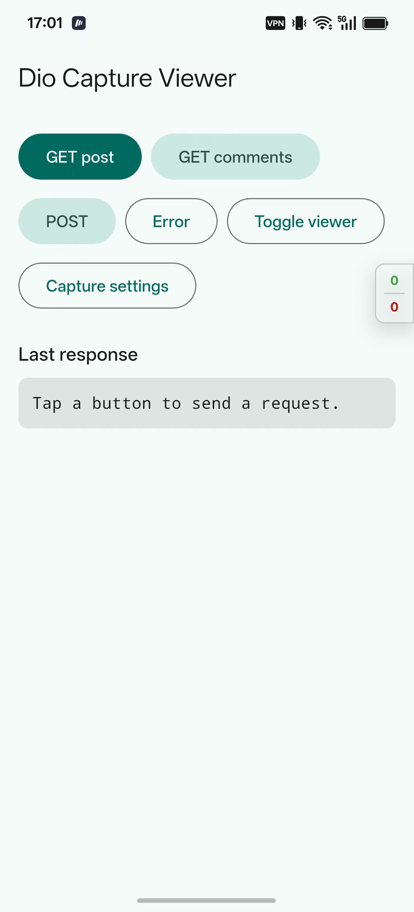
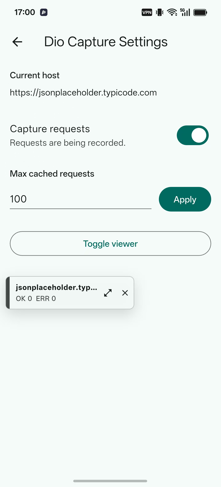

# dio_capture_viewer

[English README](README.md)

一个用于 Flutter 应用的轻量级应用内请求抓包查看器，适用于使用 Dio 的项目。

它添加一个 Dio interceptor，并提供一个应用内悬浮 Material UI 面板，用于查看请求头、查询参数、请求体、响应内容、错误、状态码和请求耗时。

## 功能特性

- 可拖拽悬浮查看器，支持迷你、贴边和全屏模式。
- Dio interceptor 支持捕获请求、响应、错误、耗时和载荷内容。
- 自动脱敏 authorization、cookie 和 token 类请求头。
- 支持请求列表过滤和载荷复制操作。
- 提供设置入口回调和可选持久化桥接。

## 预览

<p>
  
  
  
</p>

## 使用方式

创建一个 `DioCaptureViewerController`，把它创建的 interceptor 添加到 Dio，然后把 overlay 放在应用内容上方。

```dart
import 'package:dio/dio.dart';
import 'package:dio_capture_viewer/dio_capture_viewer.dart';
import 'package:flutter/material.dart';

const apiHost = 'https://api.example.com';

final navigatorKey = GlobalKey<NavigatorState>();

final captureController = DioCaptureViewerController.init(
  enabled: true,
  showPanel: true,
  navigatorKey: navigatorKey,
  host: apiHost,
  onSettingsTap: (context, store) {
    Navigator.of(context).push(
      MaterialPageRoute<void>(
        builder: (_) => YourCaptureSettingsPage(store: store),
      ),
    );
  },
  onCloseTap: (context, store) async {
    return await confirmHideCaptureViewer(context);
  },
);

final dio = Dio(BaseOptions(baseUrl: apiHost))
  ..interceptors.add(captureController.createInterceptor());

class App extends StatelessWidget {
  const App({super.key});

  @override
  Widget build(BuildContext context) {
    return MaterialApp(
      // 使用传给 DioCaptureViewerController 的同一个 key。
      navigatorKey: navigatorKey,
      builder: (context, child) {
        return DioCaptureViewerOverlay(
          controller: captureController,
          child: child ?? const SizedBox.shrink(),
        );
      },
      home: const HomePage(),
    );
  }
}
```

如果不需要从查看器按钮打开页面，`navigatorKey` 可以不传。当你使用 `onSettingsTap`，或在 `onCloseTap` 中显示弹窗时，需要把同一个 key 同时传给 `DioCaptureViewerController` 和 `MaterialApp`。

`CaptureStore` 暴露了一些设置能力，你可以放到自己的抓包设置页中：

```dart
captureController.store.setEnabled(true);
captureController.store.setMaxCacheSize(200);

final enabled = captureController.store.isEnabled;
final maxCacheSize = captureController.store.maxCacheSize;
```

如果应用已有自己的持久化层，可以实现 `CapturePreferences`，并传给 `CaptureStore(preferences: yourPreferences)`，然后在启动时调用 `captureStore.restore()`。

这个包不导出设置页。它只提供设置入口回调、悬浮查看器模式、capture store 和 Dio interceptor。

## 注意事项

这个包主要用于开发、QA 和内部调试版本。避免向最终用户展示捕获到的生产流量。

## TODO

- 支持捕获 Server-Sent Events (SSE) 流。
- 支持捕获 WebSocket 连接元数据和消息帧。
