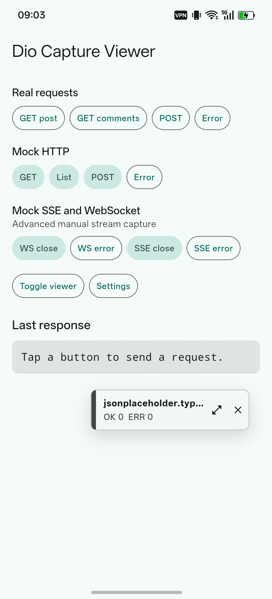
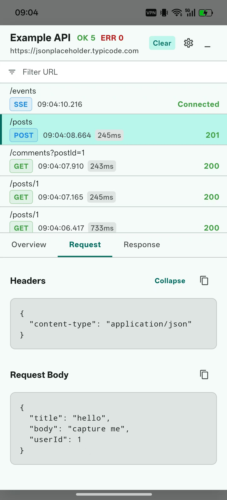
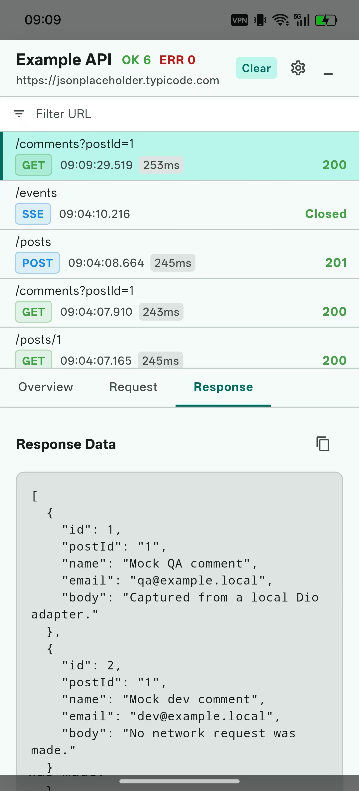
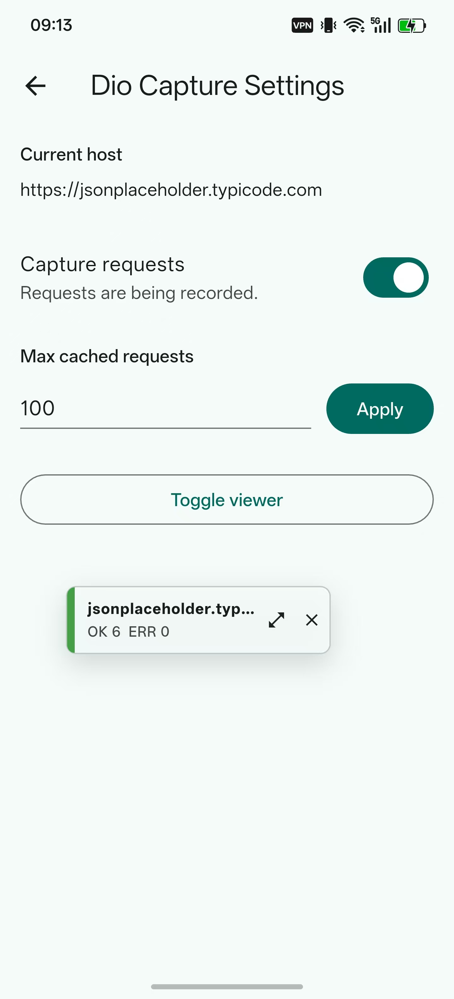

# dio_capture_viewer

[](https://pub.dev/packages/dio_capture_viewer)

[English README](README.md)

一个用于 Flutter 应用的轻量级应用内网络抓包查看器，适用于使用 Dio 的项目。

它添加一个 Dio interceptor，并提供一个应用内悬浮 Material UI 面板，用于查看请求头、查询参数、请求体、响应内容、错误、状态码、请求耗时、SSE 事件和 WebSocket 消息。

## 功能特性

- 可拖拽悬浮查看器，支持迷你、贴边和全屏模式。
- Dio interceptor 支持捕获请求、响应、错误、耗时和载荷内容。
- 支持 HTTP/Dio、手动上报的 SSE，以及手动上报的 WebSocket 会话。
- 自动脱敏 authorization、cookie 和 token 类请求头。
- 支持请求列表过滤、载荷复制，以及按协议生成 `Copy To Curl` 命令。
- 支持可选 toast 回调，用于复制、清空和隐藏等查看器操作提示。
- 图片、视频、音频、PDF、压缩包、二进制附件等文件类内容会显示为带格式和大小的占位符，不直接渲染原始内容。
- 提供设置入口回调和可选持久化桥接。

## 预览

<p>
  
  
  
  
  
</p>

## 使用方式

创建一个 `DioCaptureViewerController`，把它创建的 interceptor 添加到 Dio，然后把 overlay 放在应用内容上方。

```dart
import 'package:dio/dio.dart';
import 'package:dio_capture_viewer/dio_capture_viewer.dart';
import 'package:flutter/material.dart';

const apiHost = 'https://api.example.com';

final navigatorKey = GlobalKey<NavigatorState>();

final captureController = DioCaptureViewerController.init(
  enabled: true,
  showPanel: true,
  navigatorKey: navigatorKey,
  host: apiHost,
  onSettingsTap: (context, store) {
    Navigator.of(context).push(
      MaterialPageRoute<void>(
        builder: (_) => YourCaptureSettingsPage(store: store),
      ),
    );
  },
  onCloseTap: (context, store) async {
    return await confirmHideCaptureViewer(context);
  },
  // 可选。不需要操作提示时可以不传。
  toast: (context, message) {
    showYourToast(message);
  },
);

final dio = Dio(BaseOptions(baseUrl: apiHost))
  ..interceptors.add(captureController.createInterceptor());

class App extends StatelessWidget {
  const App({super.key});

  @override
  Widget build(BuildContext context) {
    return MaterialApp(
      // 使用传给 DioCaptureViewerController 的同一个 key。
      navigatorKey: navigatorKey,
      builder: (context, child) {
        return DioCaptureViewerOverlay(
          controller: captureController,
          child: child ?? const SizedBox.shrink(),
        );
      },
      home: const HomePage(),
    );
  }
}
```

如果不需要从查看器按钮打开页面，`navigatorKey` 可以不传。当你使用 `onSettingsTap`，或在 `onCloseTap` 中显示弹窗时，需要把同一个 key 同时传给 `DioCaptureViewerController` 和 `MaterialApp`。

`toast` 是可选项。不传时，查看器不会内置弹 toast 或 snackbar。传入后，复制、复制 curl、清空、清除搜索和隐藏查看器等操作会调用它并传入一段简短提示文案。

`CaptureStore` 暴露了一些设置能力，你可以放到自己的抓包设置页中：

```dart
captureController.store.setEnabled(true);
captureController.store.setMaxCacheSize(200);

final enabled = captureController.store.isEnabled;
final maxCacheSize = captureController.store.maxCacheSize;
```

如果应用已有自己的持久化层，可以实现 `CapturePreferences`，并传给 `CaptureStore(preferences: yourPreferences)`，然后在启动时调用 `captureStore.restore()`。

这个包不导出设置页。它只提供设置入口回调、悬浮查看器模式、capture store 和 Dio interceptor。

## 高级配置

### SSE 和 WebSocket 抓包

SSE 和 WebSocket 抓包是手动上报的，不会给本库增加额外依赖。你只需要创建一个 stream session，然后把业务里已有客户端的入站、出站、关闭和错误事件上报给它。

stream message 的 UI 刷新默认会按 2 秒节流。可以给 `DioCaptureViewerController.init` 或 `CaptureStore` 传 `streamNotifyInterval: Duration.zero`，让每条 message 都立即刷新。

```dart
final socketCapture = captureController.store.startStreamCapture(
  protocol: CaptureProtocol.webSocket,
  url: 'wss://example.com/socket',
);

// 类似 WebSocketChannel 客户端的接入方式。
channel.stream.listen(
  socketCapture.addInbound,
  onError: socketCapture.fail,
  onDone: socketCapture.close,
);

void sendSocketMessage(Object message) {
  socketCapture.addOutbound(message);
  channel.sink.add(message);
}
```

```dart
final sseCapture = captureController.store.startStreamCapture(
  protocol: CaptureProtocol.sse,
  url: 'https://example.com/events',
);

// 类似 EventSource/SSE stream 的接入方式。
eventStream.listen(
  (event) => sseCapture.addEvent(
    {'event': event.event, 'data': event.data},
    label: event.event,
  ),
  onError: sseCapture.fail,
  onDone: sseCapture.close,
);
```

如果用户手动删除某个 stream 记录，或者清空全部记录，旧 session 后续再上报的数据会被忽略，不会重新出现在列表里。自动缓存清理也会保护未断开的 SSE/WebSocket，优先清理普通 HTTP 请求和已经断开的 stream。

### 复制为 curl

Overview 页签底部提供 `Copy All` 和 `Copy To Curl` 两个操作。`Copy To Curl` 会根据捕获到的 method、URL、headers、query parameters 和 request body 生成可直接粘贴到 shell 的 curl 命令。

HTTP 请求会用 `--data-raw` 带上请求体；如果载荷像 JSON，且原请求没有 `Content-Type`，会自动补 `Content-Type: application/json`。捕获到的 `FormData` 字段会转成 `--form-string`，文件字段会以 `field=@avatar.png` 这类占位形式输出。

SSE 会生成带 `-N` 和 `Accept: text/event-stream` 的流式 HTTP curl 命令。WebSocket 会生成 `ws://` 或 `wss://` 的 curl 命令，并带上捕获到的业务 header；客户端自动生成的 WebSocket 握手 hop-by-hop header 会被跳过。

### 文件载荷展示

图片、视频、音频、PDF、压缩包、`application/octet-stream` 响应和上传文件不会在查看器里直接展示原始内容，而是显示为占位符，例如 `[avatar.png, image/png, 24.0KB]` 或 `[video/mp4, 2.4MB]`。

## Future

下个版本计划支持附件导出，方便在需要时把抓到的文件类载荷保存到查看器之外。

## 注意事项

这个包主要用于开发、QA 和内部调试版本。避免向最终用户展示捕获到的生产流量。
